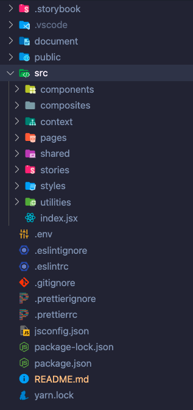

# Create React App Skeleton Project

**_contains: Storybook, MUI - (formerly Material UI), ESlint, Prettier and husky_**

## `Getting up and running quickly.`

After cloning the project from GitHub
at a terminal command line, type:

```js
npm install
```

to install all the required packages specified in package.json.

## `Background and the philosophy behind the decisions`

## Getting Started with Create React App

This project was bootstrapped with [Create React App](https://github.com/facebook/create-react-app).

    npx create-react-app [project-name]

## `Visual Studio Code`

Please use VSCode for all ReactJS development.\
[VSCode Download page](https://code.visualstudio.com/download)

## Installed Libraries

### [`ESlint`](https://eslint.org/)

A linter analyses your code statically. It checks out the code without executing it.
`ESLint` is an open-source project initially created by Nicholas C. Zakas, which provides a pluggable linting utility for JavaScript.\
It provides the first layer of safety in your application development.\
`ESLint` parses your code, analyses it, and runs linting rules. These rules may trigger warnings or errors to let you know if your code is right or wrong.

**Install ESLint**\
In an terminal (Terminal -> New Terminal) opened on a project in VSCode.

```js
npm install eslint --save-dev
```

**Note:** You can also use the [ESLint extension for VSCode](https://marketplace.visualstudio.com/items?itemName=dbaeumer.vscode-eslint)\
It'll deeply improve your developer experience by highlighting errors and warnings directly in your code. Prettier can also be executed on each save.

**Configure ESLint**\
Add the following files to the root of the application project.\
_.eslintrc_

```json
{
  "parser": "babel-eslint",
  "env": {
    "browser": true,
    "jest": true,
    "es6": true
  },
  "plugins": ["import"],
  "extends": ["eslint:recommended", "plugin:react/recommended"],
  "parserOptions": {
    "ecmaVersion": 2020,
    "sourceType": "module",
    "ecmaFeatures": {
      "jsx": true,
      "modules": true,
      "experimentalObjectRestSpread": true
    }
  },
  "rules": {
    "comma-dangle": 0,
    "react/jsx-uses-vars": 1,
    "react/display-name": 1,
    "no-console": "warn",
    "no-eval": "error",
    "import/first": "error"
  },
  "settings": {
    "react": {
      "pragma": "React",
      "version": "17.0.2"
    }
  }
}
```

_.eslintignore_

```css
node_modules/
package.json
package-lock.json
settings.json
manifest.json

```

You can now run Lint with

```js
npm run lint

```

### [`Prettier`](https://prettier.io/)

`Prettier` helps in formatting the code. It makes sure the entire codebase looks uniform when there are multiple developers working on it.

**Install Prettier**

In an terminal opened on a project in VSCode.

```js
npm install prettier --save-dev

```

**Configure Prettier**

_.prettierrc_

```json
{
  "printWidth": 75,
  "tabWidth": 2,
  "singleQuote": true,
  "trailingComma": "all",
  "bracketSpacing": true,
  "useTabs": false,
  "arrowParens": "always",
  "endOfLine": "auto",
  "semi": true
}
```

_.prettierignore_

```
node_modules/
package.json
package-lock.json
settings.json
manifest.json
```

Add the following to _package.json_

```json
{
  "scripts": {
    "format": "prettier --write \"**/*.+(js|jsx|json|css|md)\""
  }
}
```

Now you can run prettier with

```
npm run format**
```

to format your entire codebase.

### `Prettier-eslint`

`ESLint` can also format your code to some extent. As we are using `Prettier`, we need to replace ESLint’s formatting rules.\

We replace ESLint’s formatting rules and not the code-quality rules. ESLint will still check the quality for us based on the rules specified.\

The following packages need to be installed

```
eslint-config-prettier disables rules that conflict with Prettier
eslint-plugin-prettier adds the rule that format content using Prettier
```

_Install prettier-eslint_

```
npm install --save-dev eslint-config-prettier eslint-plugin-prettier
```

### [`husky`](https://typicode.github.io/husky/#/)

You can make use of Git hooks to run ESLint and Prettier before each commit or each push. Then, your code is constantly linted and formatted before deploying to production using husky

_Install husky_

```
npm install --save-dev husky
```

_Insert the following in *package.json*_

```json
{
  "husky": {
    "hooks": {
      "pre-commit": "npm run lint && npm run format"
    }
  }
}
```

At each commit, the command associated with pre-commit will be run. So your codebase will be linted and formatted.

### `MUI material and icons`

[`MUI`](https://mui.com/)

MUI is version 5 of Material UI and is a large component library and is aligned with Material Design by Google. MUI provides access to a fully customisable theme that can be overridden at the root App level.  
MUI also provides a huge set of icons that are easily imported, implemented and customised.

#### Custom Theming

### `Storybook`

    npx sb init

### `Project Structure:`

<br />



| Folder              | Sub-Folder    | Description                                                                                                                                                                                                                                                                                                                                                                                                                                                                                                             |
| ------------------- | ------------- | ----------------------------------------------------------------------------------------------------------------------------------------------------------------------------------------------------------------------------------------------------------------------------------------------------------------------------------------------------------------------------------------------------------------------------------------------------------------------------------------------------------------------- |
| `.storyBook`        |               | Storybook Config files                                                                                                                                                                                                                                                                                                                                                                                                                                                                                                  |
| `.vscode`           |               | Local VS Code preferences                                                                                                                                                                                                                                                                                                                                                                                                                                                                                               |
| `\document`         |               | Images or assets used in any README.md documentation                                                                                                                                                                                                                                                                                                                                                                                                                                                                    |
| `\src`              |               | Top-level source code folder                                                                                                                                                                                                                                                                                                                                                                                                                                                                                            |
|                     | `\components` | The custom component folder. <br /> This should stay relatively empty and and we should only add to or change the <br /> base Material Component Library if it is necessary. <br /> See below for details                                                                                                                                                                                                                                                                                                               |
|                     | `\composites` | This is the area where components from either the base MUI library or from the components project folder are combined to create a composite component that may then be used on a page or pages. <br /> The structure of the sub folders under the composites folder should match the structure and naming convention of that in the components folder and which is detailed below. It **MUST** contain a documented story allowing it to be viewed through storybook and in isolation from the rest of the application. |
|                     | `\context`    | React API Context folders and files for state management                                                                                                                                                                                                                                                                                                                                                                                                                                                                |
|                     | `\pages`      | A page is basically a component that can be reached through a URL or via the router. <br /> It is made up of one or more base components and/or composite components. A page is (normally) wrapped in a Layout and Theme component and inherits the application themes and styling from the theme in the styles folder.                                                                                                                                                                                                 |
|                     | `\shared`     | Any code that is shared between components or between projects. Example: Backend API communication via Axios                                                                                                                                                                                                                                                                                                                                                                                                            |
|                     | `\stories`    | Create stores to demonstrate or test overriding CSS or Pros for individual components. For example, if the base CSS is change for a button but not the base button component itself, a stories to demo those changes would be created and documented here.                                                                                                                                                                                                                                                              |
|                     | `\utilities`  | Enums or data formatting code files.                                                                                                                                                                                                                                                                                                                                                                                                                                                                                    |
|                     | `index.js`    | React Application entry point                                                                                                                                                                                                                                                                                                                                                                                                                                                                                           |
| `.eslintignore`     |               | Configuration file to configure eslint to ignore specified files and folders.                                                                                                                                                                                                                                                                                                                                                                                                                                           |
| `.eslintrc`         |               | eslint linting rules configuration file.                                                                                                                                                                                                                                                                                                                                                                                                                                                                                |
| `.gitignore`        |               | A config file that specifies files and folder content that we do <b>not</b> commit to github.<br /> An example would be, the node_module folder that contains all the 3rd part libraries installed with our project                                                                                                                                                                                                                                                                                                     |
| `.prettierignore`   |               | Configuration file to configure prettier to ignore specified files and folders when formatting code files.                                                                                                                                                                                                                                                                                                                                                                                                              |
| `.prettierrc`       |               | Prettier config files to specify options and formatting preferences.                                                                                                                                                                                                                                                                                                                                                                                                                                                    |
| `jsconfig.json`     |               | A simple config declaring the base code folder (\src) that the application should use. This allows to nto require to specify the relative path when importing components or .js files, instead only using the folder name.                                                                                                                                                                                                                                                                                              |
| `package-lock.json` |               | Standard package-lock.json file specifying an exact version dependency tree.                                                                                                                                                                                                                                                                                                                                                                                                                                            |
| `package.json`      |               | Standard package.json file to manage required project dependencies and basic application configuration.                                                                                                                                                                                                                                                                                                                                                                                                                 |
| `README.md`         |               | This is me. I am the README.                                                                                                                                                                                                                                                                                                                                                                                                                                                                                            |
| `yarn.lock`         |               | Installed as part of the create-react-app set-up. Not used with npm installs.                                                                                                                                                                                                                                                                                                                                                                                                                                           |

<br />

### `Folder Structure:`

<br />


<br />

<p> There should be very little need to create custom components. MUI is an extensive component library that is fully customisable for our needs. If, on the very rare occasion, we do need to create a custom component, it must adhere to the following folder structure and include all the files outlined below. In particular, it must have a READ.md file with the reason for the custom component being added.</p>

<br />

| Folder           | File                  | Description                                                                                                                                                                                                                                              |
| ---------------- | --------------------- | -------------------------------------------------------------------------------------------------------------------------------------------------------------------------------------------------------------------------------------------------------- |
| `\compoments`    |                       |                                                                                                                                                                                                                                                          |
| `\compomentName` |                       |                                                                                                                                                                                                                                                          |
|                  | `[ComponentName].jsx` | A React component built with a .jsx file extension. Ensure that the first letter of each work of the component is capitalised and that within the component, all props that maybe changed have their propTypes and default props specified.              |
|                  | `[ComponentName].mdx` | A storybook file with a .mdx extension. The addition of a .mdx extension <br /> allows for greater control of the component documentation                                                                                                                |
|                  | `index.js`            | File to export the component via the convention of a index.js                                                                                                                                                                                            |
|                  | `style.js`            | The style that are specific to the component. These must be used very sparingly and if we do need additional customised CSS or styling, we must include notes on the need to use additional styling outside of the wrapped theme from the styles folder. |
|                  | `[ComponentName].md`  | A readme file outlining the need to create or customise this component.                                                                                                                                                                                  |
| `index.js`       |                       | The component root folder index.js file. Export all component via a single reference to this file                                                                                                                                                        |

### `Useful VSCode Extensions`

<br />

1. Thunder Client <br />
   [Thunder (API) Client](https://marketplace.visualstudio.com/items?itemName=rangav.vscode-thunder-client).\
   A lightweight alternative to Postman that can be run directly from VS Code.
